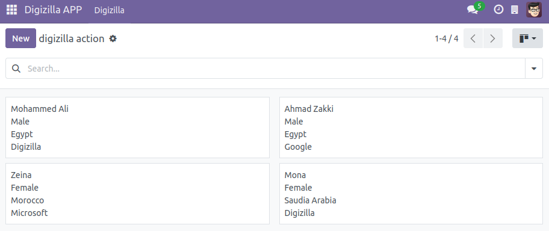
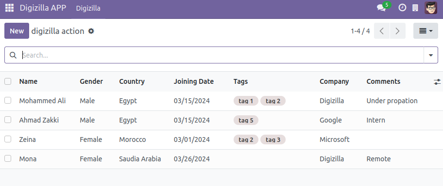
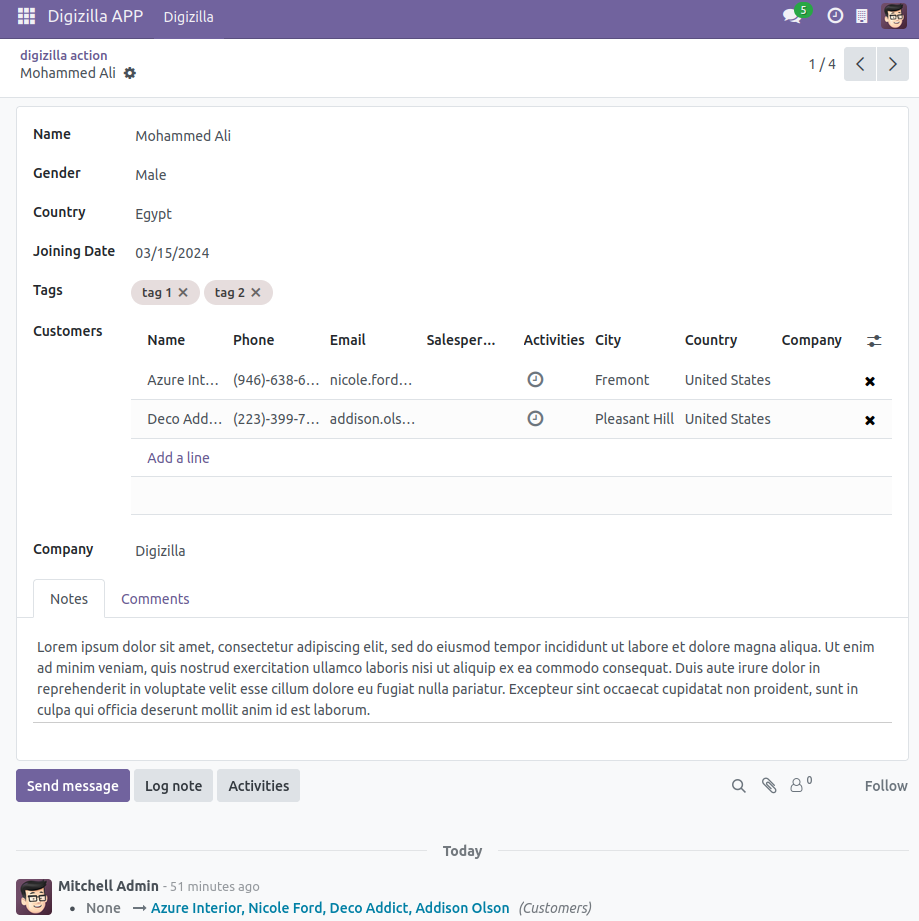
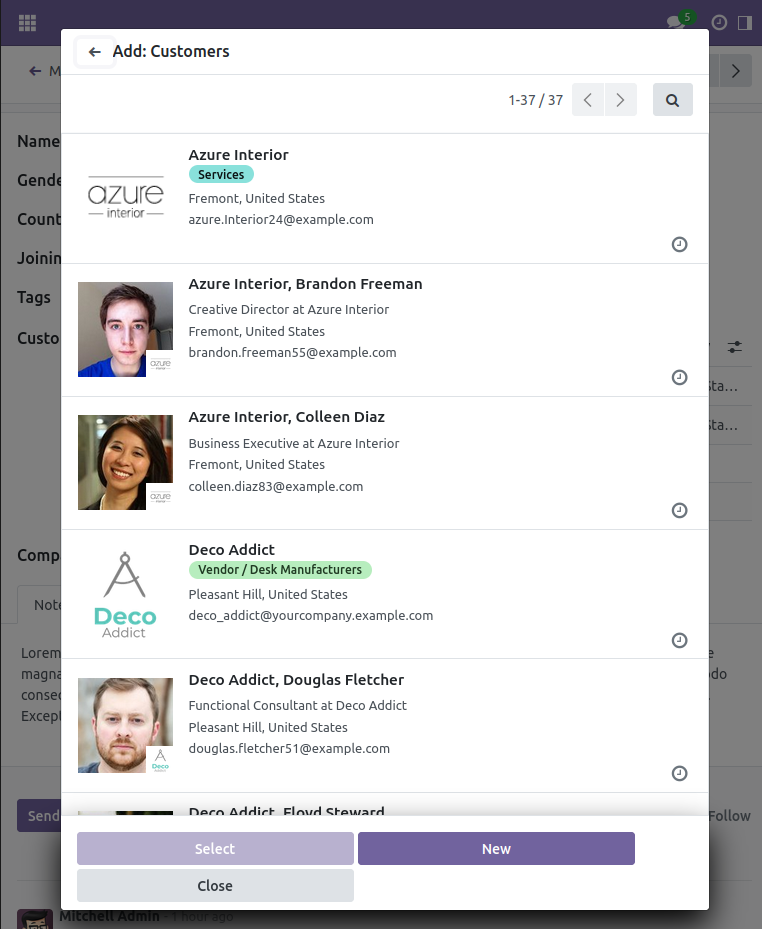
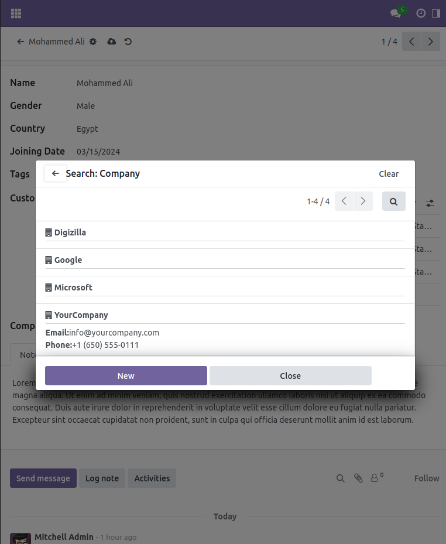
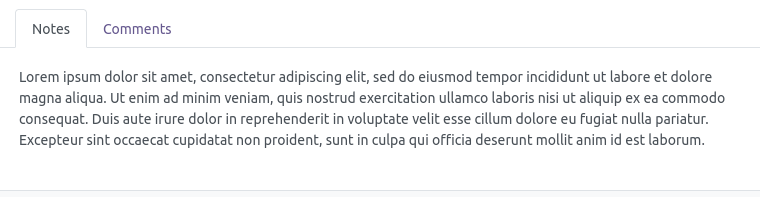
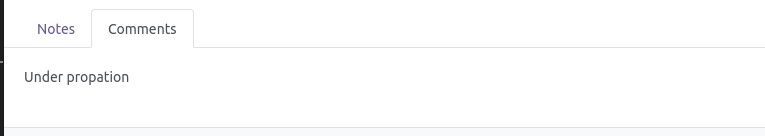
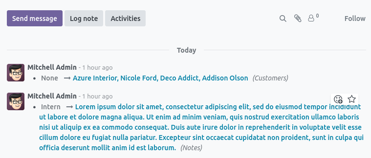
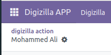

# odoo-digizilla-assessment 
This repo is the submission of the required tasks of the Digizilla Python Developer assessment

## Tasks
Develop Odoo (v17 community) module as follows: 
Create a model with the name "Digizilla" as follows:
- Required Views:
  - [Kanban](#kanban)
  - [Form](#form)
  - [List](#list)
- [Required Fields](#fields)
- Required Tasks
  - [Odoo default customers model](#customer)
  - [Odoo default Company model](#company)
  - [Notes in a new tab](#notes)
  - [Comments in a new tab](#comments)
  - [Messages and Logger Tracker](#log)
  - [Hidden `Create` Button in form view](#hide)

## Required Views
### Kanban
  <a name="kanban"></a>
  
  
### List
  <a name="list"></a>
  

### Form    
  <a name="form"></a>
  

## Required Fields
  <a name="form"></a>
    Name, Gender, Country, Joining Date,  Tags, Customers, Company, Notes, Comments
    
  ```python
        from odoo import models, fields

        class Digizilla(models.Model):
            _name = "model.digizilla"
            _description = "Digizilla Member"
            _inherit = ["mail.thread","mail.activity.mixin"]

            name    = fields.Char(string='Name', required=True, tracking=1)
            gender  = fields.Selection( 
                [ 
                    ('male', 'Male'),
                    ('female', 'Female')
                ], string='Gender' , tracking=1)
            country     = fields.Char(string='Country', default="Egypt" , tracking=1)
            joining_date = fields.Date(string='Joining Date' , tracking=1)
            tag_ids     = fields.Many2many('model.tag', string='Tags' , tracking=1)
            customer_ids = fields.Many2many('res.partner', string='Customers' , tracking=1)
            company_id  = fields.Many2one('res.company', string='Company', required=True , tracking=1)
            notes       = fields.Text(string='Notes' , tracking=1)
            comments    = fields.Char(string='Comments' , tracking=1)
  ```

## Required Tasks

  ### Odoo default customers model
   <a name="customer"></a>
   
   Create Customers where you can select multiple values from odoo default customers model 

   
  
  ## Odoo default customers model
   <a name="customer"></a>
   
   Create Company field where you can select one value from Odoo default companies official model

   

  ## Notes in a new tab
  <a name="notes"></a>
  

  ## Comments in a new tab
  <a name="comments"></a>
  

  ## Messages and Logger Tracker
  <a name="log"></a>
  
  
  ## Hidden `Create` Button in form view
  <a name="hide"></a>
  
  